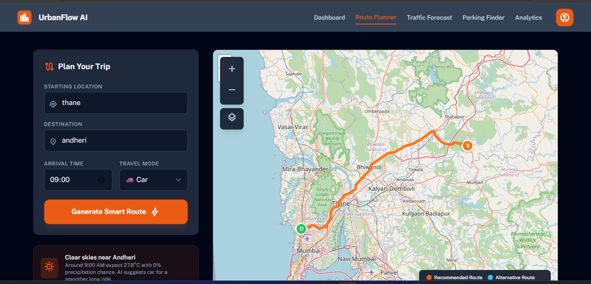
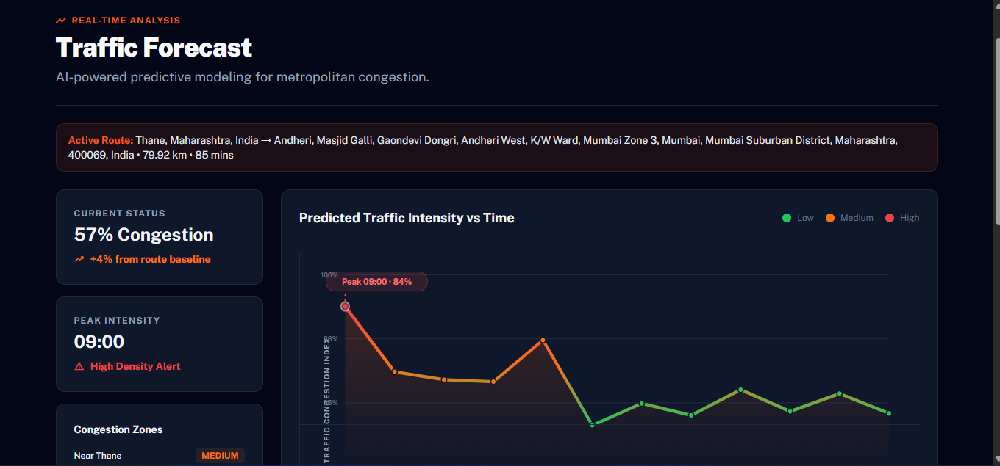
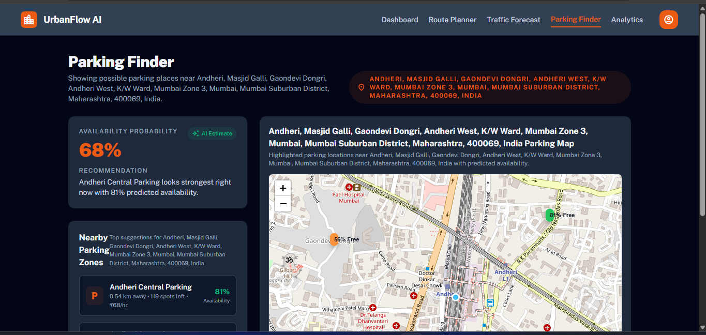
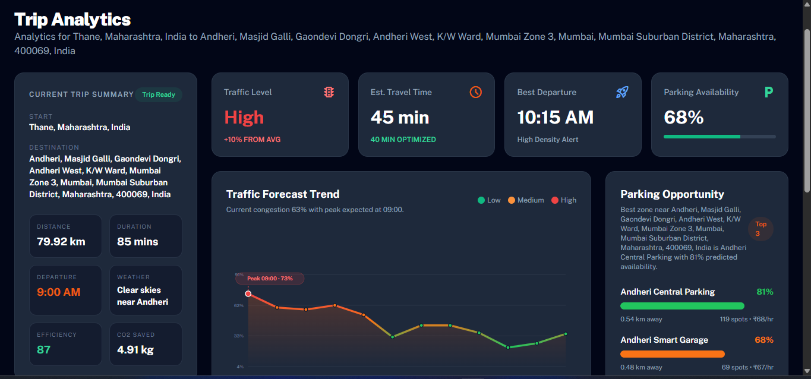

# UrbanFlow AI

UrbanFlow AI is a route-first urban mobility assistant that brings traffic forecasting, smart departure planning, parking prediction, and trip analytics into one flow.

The project is designed around a simple user journey:

1. Plan a trip in the Route Planner.
2. Forecast traffic for that exact route.
3. Check likely parking near the destination.
4. Review the trip in a dedicated analytics dashboard.

What makes it useful is that the pages are connected. Once a route is generated, the selected trip is carried across the app using session state, so the traffic, parking, and analytics pages all stay focused on the same source and destination.

## What The Project Does

- Generates a shortest driving route between two locations.
- Geocodes addresses with OpenStreetMap Nominatim.
- Uses OpenRouteService to calculate road routes.
- Predicts traffic conditions for the route over the next 1 to 3 hours.
- Suggests a better departure window using a lightweight departure optimizer.
- Predicts parking availability near the destination.
- Adds AI-generated traffic insight using Groq.
- Summarizes the trip in a route-aware analytics page.

## Project Pages

- `dashboard.html`: landing page and entry point
- `route_planner.html`: route generation, map rendering, weather, route metrics
- `traffic_forecast.html`: route-specific congestion forecast and AI traffic insight
- `parking_finder.html`: destination-based parking recommendations and map markers
- `analytics.html`: combined trip summary with traffic and parking analytics

## Tech Stack

### Frontend

- HTML
- Tailwind CSS
- Vanilla JavaScript
- Leaflet.js
- OpenStreetMap tiles

### Backend

- FastAPI
- Uvicorn
- Pydantic
- Python standard library utilities for HTTP and routing helpers

### Data and ML

- Pandas
- NumPy
- scikit-learn
- PyTorch
- Chronos Forecasting (`amazon/chronos-t5-small`)
- Joblib

### External APIs and Services

- Nominatim OpenStreetMap geocoding
- OpenRouteService directions API
- Open-Meteo weather API
- Groq API for AI traffic insights

## Architecture

At a high level, the app is split into a static frontend and a FastAPI backend.

- The frontend serves the UI and stores the active trip in `sessionStorage`.
- The backend exposes route, traffic, and parking endpoints.
- CSV-based traffic features and predictions support the forecasting workflow.
- External services are used only where they add value: geocoding, routing, weather, and LLM insight generation.

### Architecture Flow

```mermaid
flowchart LR
    A[Dashboard / Route Planner] --> B[Route saved in sessionStorage]
    B --> C[Traffic Forecast Page]
    B --> D[Parking Finder Page]
    B --> E[Analytics Page]

    A --> F[FastAPI Backend]
    F --> G[/api/route/optimize]
    F --> H[/api/traffic/predict]
    F --> I[/api/parking/predict]

    G --> J[Departure Optimizer]
    H --> K[Chronos-based Traffic Service]
    I --> L[Destination-aware Parking Generator]

    A --> M[Nominatim]
    A --> N[OpenRouteService]
    A --> O[Open-Meteo]
    H --> P[Groq]

    K --> Q[traffic_features.csv]
    K --> R[traffic_predictions.csv]
```

## Repository Structure

```text
.
├── client/
│   ├── dashboard.html
│   ├── route_planner.html
│   ├── traffic_forecast.html
│   ├── parking_finder.html
│   ├── analytics.html
│   └── config.js
├── server/
│   ├── app.py
│   ├── departure_optimizer.py
│   ├── routes/
│   │   ├── routing.py
│   │   ├── traffic.py
│   │   └── parking.py
│   └── models/
│       ├── feature_engineering.py
│       ├── traffic_forecaster.py
│       ├── train_model.py
│       └── README.md
├── datasets/
│   ├── traffic_features.csv
│   └── traffic_predictions.csv
├── run_training.py
├── requirements.txt
└── .env
```

## Data Pipeline

The traffic workflow is file-backed rather than database-backed.

### 1. Feature Engineering

`server/models/feature_engineering.py` creates engineered traffic features from the base traffic dataset.

Generated features include:

- lag features: `lag_1`, `lag_2`, `lag_3`
- rolling statistics: `rolling_mean_3`, `rolling_mean_6`, `rolling_mean_12`
- time features: `hour`, `day_of_week_num`, `is_weekend`, `is_rush_hour`
- categorical encodings: `city_encoded`, `road_type_encoded`, `day_of_week_encoded`

Output:

- `datasets/traffic_features.csv`

### 2. Traffic Forecast Generation

`server/models/traffic_forecaster.py` loads the engineered dataset and uses Chronos to produce traffic forecasts.

Output:

- `datasets/traffic_predictions.csv`

### 3. Route-Time Inference

`server/routes/traffic.py` consumes those predictions and turns them into:

- 1-hour traffic windows
- 3-hour traffic windows
- peak intensity
- congestion zones
- rerouting summary
- AI insight for the chosen route

### 4. Parking Prediction

`server/routes/parking.py` geocodes the destination, creates nearby synthetic parking zones around it, and returns:

- overall parking probability
- top parking suggestions
- availability percentages
- distances and price estimates

### 5. Frontend State Handoff

The selected trip is stored in `sessionStorage` under a shared key so that:

- Traffic Forecast uses the same route context
- Parking Finder uses the same destination
- Analytics summarizes the same trip

## Models Used And Why

### 1. Chronos T5 Small

- Model: `amazon/chronos-t5-small`
- Used for: traffic forecasting
- Where: `server/models/traffic_forecaster.py`
- Why: it gives a simple way to produce short-horizon time-series forecasts from historical traffic data

### 2. Rule-Based Departure Optimizer

- Used for: choosing a better departure time from predicted traffic windows
- Where: `server/departure_optimizer.py`
- Why: it is lightweight, deterministic, and easy to combine with traffic predictions

### 3. Groq-hosted LLM

- Used for: generating concise route-specific traffic insight
- Where: `server/routes/traffic.py`
- Why: it turns forecast numbers into a commuter-friendly recommendation sentence

### 4. Heuristic Parking Ranking

- Used for: ranking parking zones by predicted availability and distance
- Where: `server/routes/parking.py`
- Why: the parking flow is currently destination-aware and fast, without requiring a full parking ML pipeline

## ML Evaluation Notes

This project now includes a reproducible offline evaluation for the traffic forecasting pipeline using `amazon/chronos-t5-small`.

### Current offline holdout results

- Evaluation script: `server/models/evaluate_model.py`
- Output artifact: `server/models/evaluation_results.json`
- Dataset: `datasets/traffic_features.csv`
- Split strategy: time-based holdout using the last `24` hourly points from each city + road-type series
- Coverage: `24` series evaluated, `576` forecast points total

#### Traffic density regression

- MAE: `4.3751`
- RMSE: `6.5116`
- MAPE: `11.5519%`

#### Congestion label classification

- Accuracy: `0.7760`
- Macro F1: `0.7648`

These values were generated by forecasting the held-out horizon from each historical series, then comparing predicted `traffic_density` against the real values and converting the predicted densities back into `low`, `medium`, and `high` congestion classes.

### Operational metrics available in-repo

From the model notes already present in the codebase:

- feature engineering: roughly 10 to 30 seconds depending on dataset size
- model loading: roughly 5 to 10 seconds the first time
- prediction generation: roughly 1 to 2 minutes for the configured setup
- API response time: intended to stay low because cached prediction files are used during inference

### Suggested evaluation metrics for the next iteration

If this project is extended, the most useful next metrics to add would be:

- rolling-window backtests instead of one final-horizon holdout
- per-city and per-road-type MAE / RMSE breakdowns
- latency per API endpoint
- parking recommendation hit rate
- route recommendation acceptance rate

## Screenshots

For GitHub, I would recommend adding screenshots to a folder such as `docs/screenshots/` and referencing them like this:

```md





```

Suggested screenshots to include:

- Dashboard hero / landing page
- Route Planner with generated route on Leaflet
- Traffic Forecast with dynamic chart
- Parking Finder with destination parking markers
- Analytics page with KPI cards and recommendations

## API Overview

### `POST /api/route/optimize`

Used to produce route options and departure recommendations.

Returns:

- alternative route candidates
- recommended route id
- estimated travel time
- route efficiency metadata

### `POST /api/traffic/predict`

Used to generate route-specific traffic analytics.

Returns:

- `predictions_1hr`
- `predictions_3hr`
- `current_status`
- `peak_intensity`
- `congestion_zones`
- `rerouting_summary`
- `ai_insight`
- `recommended_departure`

### `POST /api/parking/predict`

Used to generate destination parking analytics.

Returns:

- `overall_probability`
- `parking_zones`
- `destination_location`
- `recommendation`

### `GET /api/health`

Simple health check endpoint.

## Environment Variables

The project currently uses:

```env
GROQ_API_KEY=your_groq_key
API_HOST=localhost
API_PORT=8000
CORS_ORIGINS=*
```

The frontend route planner also reads an OpenRouteService key from `client/config.js`.

## How To Run

### 1. Install dependencies

```bash
pip install -r requirements.txt
```

### 2. Add environment variables

Create or update `.env` with your keys.

### 3. Start the backend

```bash
cd server
python app.py
```

### 4. Open the app

Then open:

- `http://localhost:8000/`

That serves `client/dashboard.html` as the main page.

## Training / Prediction Generation

If you want to regenerate the prediction artifacts:

```bash
python run_training.py
```

This runs:

1. feature engineering
2. Chronos model loading
3. traffic prediction generation

## Current Limitations

- The project is not database-backed yet; it currently uses CSV files plus frontend session state.
- Parking prediction is destination-aware, but still heuristic rather than learned from a real occupancy dataset.
- Route optimization combines real map services with lightweight backend logic; it is not yet a full multi-objective routing engine.
- Formal ML evaluation metrics are not yet committed in the repo.

## Why This Project Works Well As A Demo

UrbanFlow AI is easy to demo because the journey feels connected:

- plan a route
- see route-specific traffic
- see likely parking near the destination
- review the same trip in analytics

That continuity makes the project feel like one product instead of a set of disconnected pages.

## Future Improvements

- add a real database layer for trips, users, and parking history
- persist trip history beyond browser session state
- add formal model evaluation notebooks and experiment tracking
- connect parking prediction to real occupancy or sensor feeds
- expose route alternatives with trade-off scoring
- add authentication and user-specific commute history

---

If you use this repository on GitHub, the README will look best once you add 4 to 5 screenshots under a `docs/screenshots/` folder and reference them in the screenshots section above.
